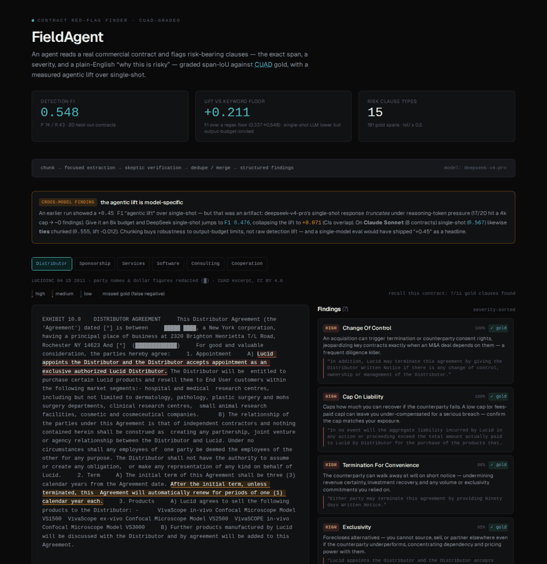
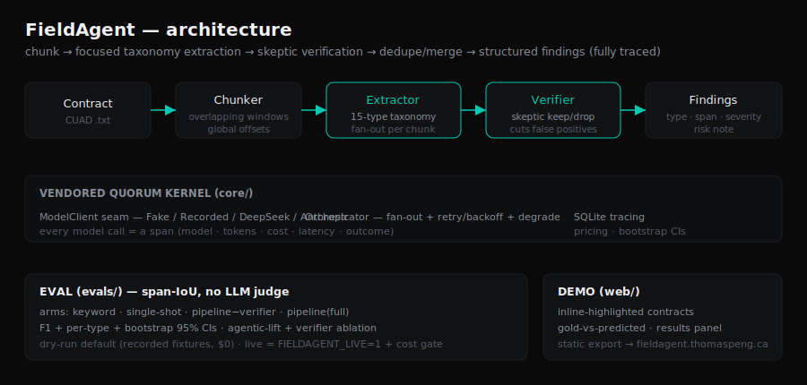

# FieldAgent — Contract Red-Flag Finder

> Portfolio artifact #3 (sibling to [Quorum](https://github.com/7P3ng/quorum) agent infra and [Aegis](https://github.com/7P3ng/aegis) agent-safety).
> A rigorous, reproducible CUAD contract red-flag detector — and a **cross-model evaluation that
> caught my own headline claim being a model-specific artifact**. Drop an agent into a messy real
> vertical, measure it honestly, and let the eval correct the story.

**Live demo:** https://fieldagent.thomaspeng.ca  ·  **Dataset:** [CUAD v1](https://www.atticusprojectai.org/cuad) (CC BY 4.0)

## Headline numbers
_(`make eval-dry` reproduces these offline from committed fixtures, zero cost — a test asserts it)_

| Claim | Result |
|---|---|
| **Detection** | **F1 = 0.548** on DeepSeek-v4-pro (P 0.74 / R 0.44, 95% CI [0.46, 0.64]) — 20 held-out CUAD contracts, 15 risk clause types, 191 gold spans, span-IoU ≥ 0.5. **Detection recall 0.59** (right clause type, any overlap): most of the recall gap is clauses found but quoted too tightly to clear IoU 0.5, not true misses. |
| **The agentic lift is mostly a truncation artifact (the interesting finding)** | A naive single-shot LLM *looked* far worse (+0.45 F1 "lift") — but only because deepseek-v4-pro's single-shot response **truncates** under reasoning-token pressure (17/20 hit a 4k-token cap → ~0 findings). Give it an 8k budget and DeepSeek single-shot jumps to **F1 0.476**, collapsing the lift to **+0.07** (95% CIs overlap → within noise). **Cross-model check:** on **Claude Sonnet** single-shot (**0.567**) likewise **ties** the chunked pipeline (0.555) — lift **−0.01**. So chunking's real value is *robustness to a model's output-budget limits*, not raw detection superiority — a single-model, single-budget eval would have shipped "+0.45" as a headline. See [cross-model results](evals/results/cross_model_claude.json) + [writeup §4–5](docs/writeup.md). |
| **Pipeline vs floor** | The pipeline beats a keyword/regex floor by **+0.21 F1** (0.337 → 0.548) — baseline-independent. The skeptic verifier is within noise (ΔF1 −0.014, overlapping CIs). |



## What it does
Reads a real contract and flags **risk-bearing clauses** — exact offending span, a severity, and a
plain-English "why this is risky" — for 15 CUAD clause types (Uncapped Liability, Cap On Liability,
Liquidated Damages, Renewal Term, Non-Compete, Exclusivity, No-Solicit Of Employees, Most Favored Nation,
IP Ownership Assignment, License Grant, Termination For Convenience, Anti-Assignment, Change Of Control,
Source Code Escrow, Audit Rights).

## Architecture
`chunk → focused taxonomy extraction (fan-out) → skeptic verification → dedupe/merge → structured findings`,
fully traced. Vendors Quorum's kernel (`core/`): the `ModelClient` seam (Fake/Recorded/DeepSeek/Anthropic),
SQLite tracing, the concurrent orchestrator, and per-model pricing. Grading is **span-IoU** (no LLM judge in
the success path). See [`docs/writeup.md`](docs/writeup.md) for the full methodology + ablations + threats.



## Run it
```bash
python -m venv .venv && .venv/bin/pip install -e ".[dev]"
make test          # unit suite, no network, no paid calls
make fetch-cuad    # sha256-pinned CUAD_v1.json (raw text stays local, gitignored)
make eval-dry      # reproduce the headline tables from committed fixtures (zero cost)
# Live (needs a DeepSeek key + opt-in; prints a cost estimate and refuses runs over $1):
export OSSLLM_API_KEY=...   # or source your DeepSeek env file
FIELDAGENT_LIVE=1 make eval-live
# Analyze your own contract:
FIELDAGENT_LIVE=1 .venv/bin/python cli/analyze.py path/to/contract.txt
```

## Attribution
This project evaluates against **CUAD v1** — The Contract Understanding Atticus Dataset, The Atticus Project,
https://www.atticusprojectai.org/cuad — licensed CC BY 4.0. Raw contract text is not redistributed here;
`evals/benchmark/fetch_cuad.py` reconstitutes it locally (sha256-pinned).
